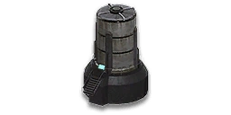
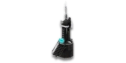

# Router Drop

Router dropping describes the method of using multiple players carrying different construction modules
being flown out via ESF or Valkyire to quickly build small construction outposts within the vicinity of 
facilities to be attacked.

It's main advantage lies in its speed, as the previous step of pulling ANTs to harvest cortium usually
falls out.

!!! info "Prerequisites"
    Having unlocked <b>Logistics certifications I</b> are required to conduct basic variations of the router drop.

## Basic variant (Duo)

The easiest way to cover most key concepts regarding router dropping is to go over it's most basic variant including 
two players.

### Aquiring modules

Construction modules can be aquired from <b>cortium silo terminals</b> or from <b>deployed ANTs</b>. The absolute minimum 
amount of modules required for aquiring a router are the <b>routing spire</b> as well as a nearby <b>cortium silo</b> to 
power it.

=== "Image: Terminals"

    
    !!! warning "Silo storage & reserved mode"
        Cortium silos feature an indicator for their amount of stored cortium. Should the amount of cortium drop below a certain threshold <i>(less than 4 squares on the indicator)</i>, the silo will enter reseved mode and bar access to any player that <b>isn't in a squad with the silos constructor</b>!

=== "Image: Construction Menu"

    
    !!! info "Construction menu navigation"
        The <b>cortium silo</b> can be found within the <b>CORE</b> tab. The routing spire is located under <b>SPIRES</b>. Click the star icon located within the yellow circle to favourite the modules, causing them to be listed in <b>FAVOURITES</b>.

=== "Image: Holding module"

    
    !!! failure "Global NDZ-Bug"
        Should you get a promt saying "you are in a no-deploy zone" despite being outside the red circles drawn within the minimap, you unfortunately have contracted the <b>global no-deploy zone</b> bug which requires you to restart the game before being able to place any construction modules.

  

Sufficiently filled cortium silos are usually found at larger construction bases further away from the frontlines. 
A good tip would be to search for <b>command centers</b> within the map screen's spawn list.

Obviously spawns provided by <b>rebirthing centers</b> or <b>elysium spawn tubes</b> can also have well filled cortium silos nearby. Note that listed spawn entries 
feature small icons depicting which terminals are nearby for use:

  

!!! note "Aircraft terminal availability"
    It generally recommended to source construction modules from bases which feature local aircraft terminals. That way aircraft can be pulled quickly at a discounted nanite in order to fly out the modules to the desired location.

### Conducting the Router drop

<table>
  <thead>
    <tr>
      <th></th>
      <th align="center">Iteration 1</th>
      <th align="center">Iteration 2</th>
    </tr>
  </thead>
  <tbody>
    <tr>
       <td style="text-align:center; vertical-align:middle;">Player 1</td>
      <td align="center">
         
        Cortium Silo
      </td>
      <td align="center">
         
        Routing Spire
      </td>
    </tr>
    <tr>
       <td style="text-align:center; vertical-align:middle;">Player 2</td>
      <td align="center">
         
        Routing Spire
      </td>
      <td align="center">
         
        Cortium Silo
      </td>
    </tr>
  </tbody>
</table> 
